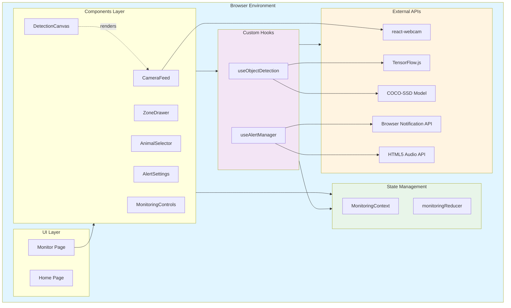
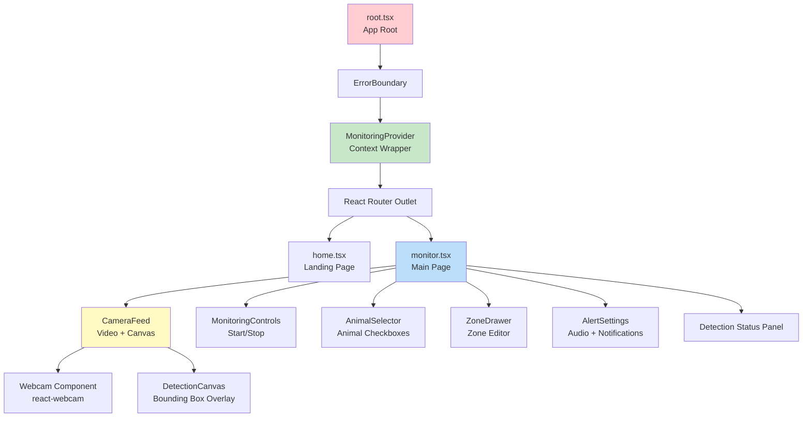
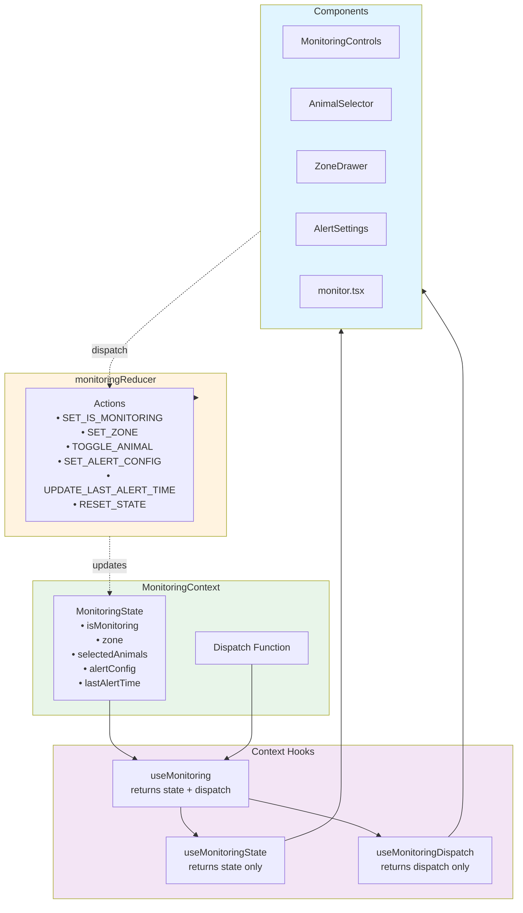
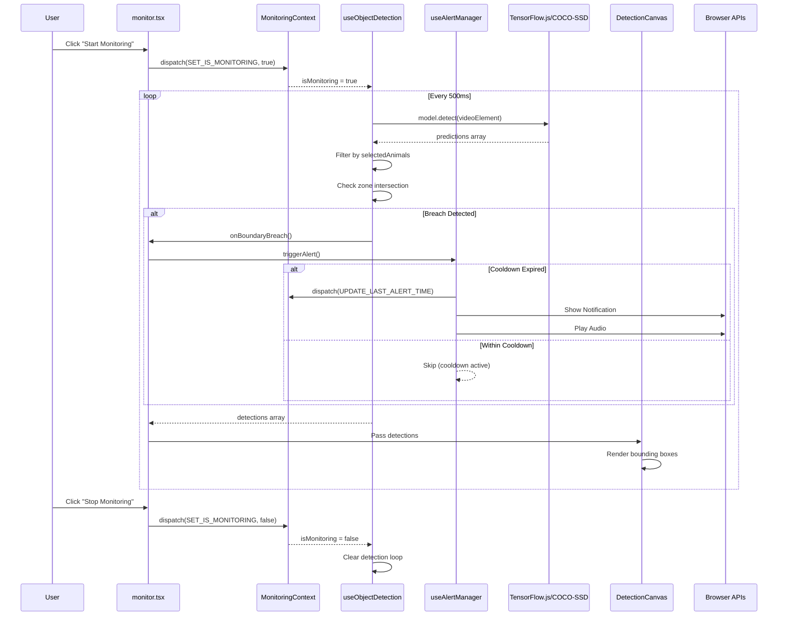
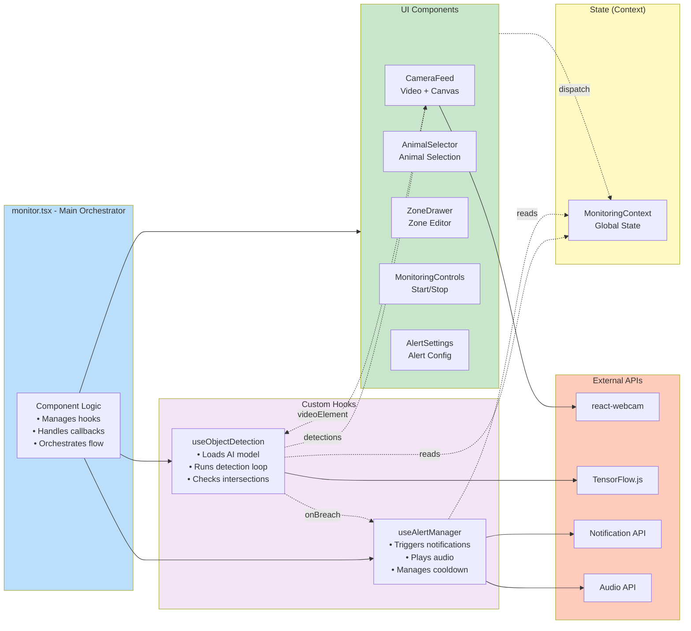
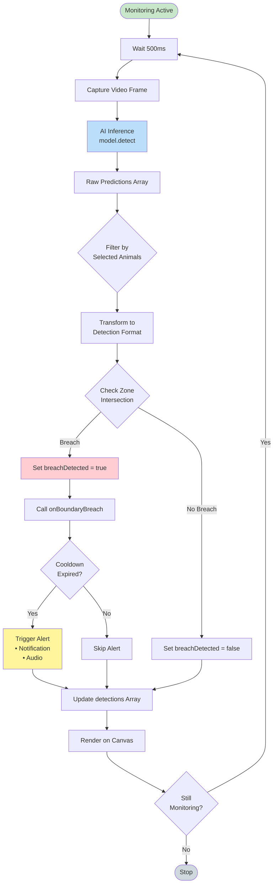
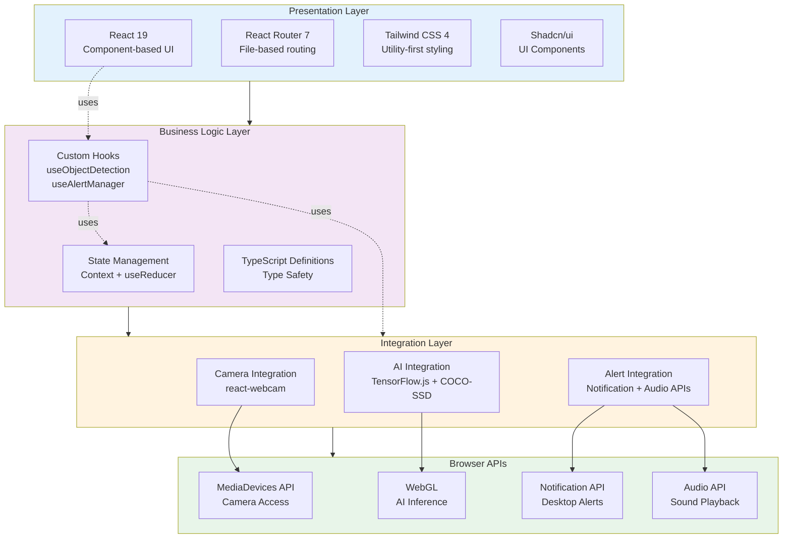
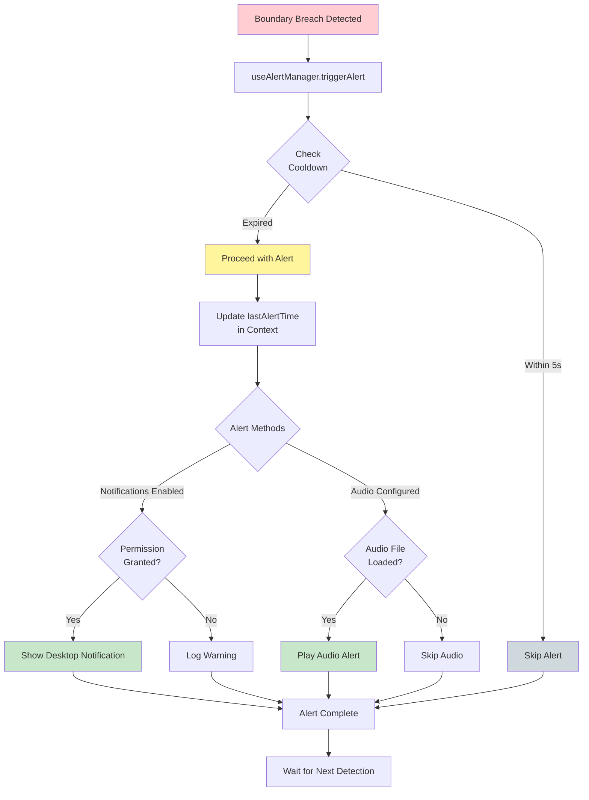
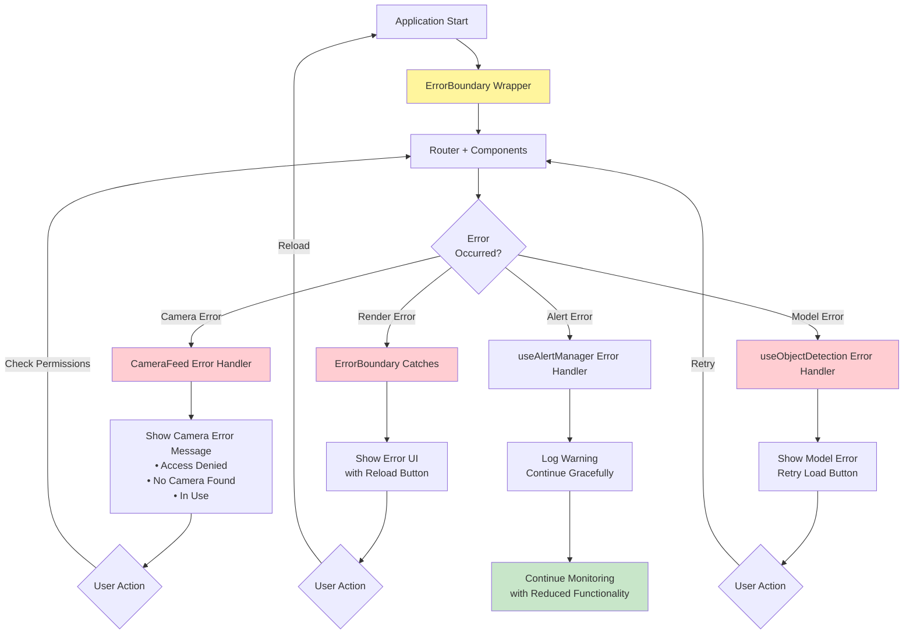

# Zone Guardian - Architecture Diagrams

This document contains visual representations of the Zone Guardian system architecture.

## 1. System Overview



## 2. Component Hierarchy



## 3. State Management Architecture



## 4. Data Flow - Detection Pipeline



## 5. Component Integration Map



## 6. Detection Loop Flow



## 7. User Interaction Flow

```mermaid
flowchart TD
    Start([User Opens /monitor]) --> Init[Initialize Components]
    Init --> Camera{Camera<br/>Access?}

    Camera -->|Denied| Error1[Show Error Message]
    Camera -->|Granted| LoadModel[Load COCO-SSD Model]

    LoadModel --> Ready[Ready State]

    Ready --> Config[User Configuration]
    Config --> SelectAnimals[Select Animals to Monitor]
    Config --> DrawZone[Draw Restricted Zone]
    Config --> SetupAlerts[Configure Alerts<br/>Audio + Notifications]

    SelectAnimals --> Validate{Ready to<br/>Start?}
    DrawZone --> Validate
    SetupAlerts --> Validate

    Validate -->|Missing Config| Config
    Validate -->|Complete| Enable[Enable Start Button]

    Enable --> StartBtn[User Clicks<br/>"Start Monitoring"]
    StartBtn --> Monitor[Begin Detection Loop]

    Monitor --> DetectLoop{Detection<br/>Running}
    DetectLoop -->|Breach| Alert[Show Alert]
    DetectLoop -->|No Breach| Continue[Continue Monitoring]

    Alert --> Continue
    Continue --> Stop{User Clicks<br/>Stop?}

    Stop -->|No| DetectLoop
    Stop -->|Yes| StopMonitor[Stop Monitoring]
    StopMonitor --> Ready

    style Start fill:#c8e6c9
    style Monitor fill:#bbdefb
    style Alert fill:#ffcdd2
    style Ready fill:#fff9c4
```

## 8. Technology Stack Layers



## 9. Alert System Architecture



## 10. Error Handling Flow



## Architecture Highlights

### Key Design Patterns

1. **Context + Reducer Pattern**
   - Centralized state management
   - Predictable state updates via actions
   - Avoids prop drilling

2. **Custom Hooks Pattern**
   - Encapsulates complex logic
   - Reusable and testable
   - Separates concerns (UI vs Logic)

3. **Callback Pattern**
   - Component communication via callbacks
   - Unidirectional data flow
   - Clean component boundaries

4. **Error Boundary Pattern**
   - Graceful error handling
   - Prevents full app crashes
   - User-friendly error messages

### Performance Optimizations

1. **Detection Interval**: 500ms balanced for performance
2. **Lite Model**: lite_mobilenet_v2 for speed
3. **Canvas Sync**: ResizeObserver for efficient rendering
4. **Cooldown**: 5s prevents alert spam
5. **Cleanup**: Proper resource disposal prevents memory leaks

### Privacy & Security

1. **Client-Side Only**: No server processing
2. **Local Inference**: AI runs in browser
3. **No Data Upload**: Video never leaves device
4. **No Tracking**: Zero analytics or cookies
5. **Open Source**: Auditable codebase
